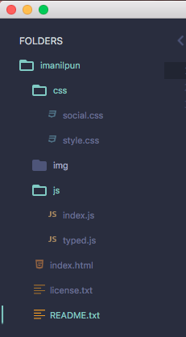

# Portfolio

This is my simple static portfolio [https://imanilpun.github.io/portfolio/](https://imanilpun.github.io/portfolio/) with particles JS influence by [Marc Brüderlin](https://github.com/marcbruederlin/particles.js).  

[](https://marcbruederlin.github.io/particles.js/)

## Overview

This portfolio page contain social page link with CSS 3D hover effects. Inaddition, Type JS is inspired by [bootstrapmade Folio](https://bootstrapmade.com/demo/themes/Folio/index.html). Moreover, Google map is added at footer where I'm currently living.

[](https://imanilpun.github.io/portfolio/) []()

## File Path

There is mainly three folder and files:

```sh
1. CSS Folder
    1.1 Social.CSS
    1.2 Style.CSS
    
2. IMG Folder
    There are different image file as required for this portfolio site.
    
3. JS Folder
    1.1 Index.JS
    1.2 Typed.JS
    
4. Index.html

5. Readme file etc...

```


## Todos

As this portfolio is influence by different design aspects, there is certain things left to do:

- Cleanup Code `As we can clear see in 'File Path' CSS and JS folder needs make clean and understandable code lines, so that everyone can understand the linkage between those file to main INDEX file.`
- Comment `To make code understable to other developer 'comment' should be given so that other coder can understand those lines.` 
